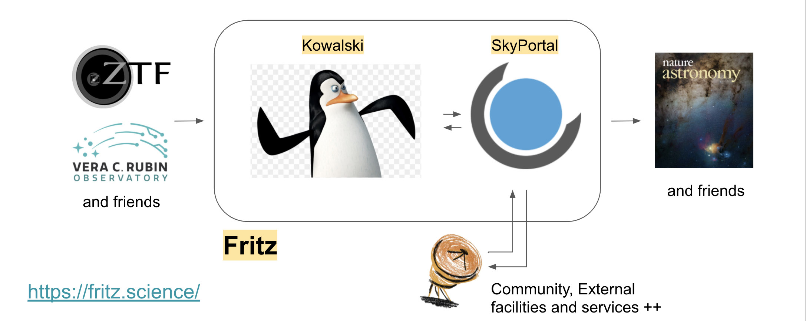

# Technical implementation

This is the TL;DR section of the docs.

The key characteristics of Fritz are efficiency, scalability, portability, and extensibility.
Fritz employs a modular architecture and
integrates and extends two major components: [BOOM](https://github.com/boom-astro/boom)
acts as the alert processor and data archive, and [SkyPortal](https://github.com/skyportal/skyportal),
which handles the rest of the stack.
The schematic overview of our system is shown below:

## BOOM and SkyPortal

A non-relational (NoSQL) database `MongoDB` powers the data archive, the alert stream sink,
and the alert handling service. We base the choice of `MongoDB` as the workhorse on the following reasons:

- Individual alerts are stored as binary `JSON` (`BSON`) "documents" in "collections",
  a natural format for the `AVRO` alert packets.
- Collections are implemented as B-trees, which guarantees `~log(N)` execution times for the standard
  CRUD operations, where `N` is the number of documents in the collection.
- Collections support multiple (compound) indexes and associated (in-memory) "covered" queries,
  which will provide efficient access to the most-in-demand data.
- Being a NoSQL database, `MongoDB` does not enforce any schema by default
  meaning no downtime in case of an alert packet schema change.
- Built-in `GeoJSON` support with 2D indexes on the sphere allowing efficient (potentially complicated) positional queries.
- Built-in support for horizontal scaling through sharding.

An HTTP API layer provides the interface to the backend, and is what SkyPortal talks to:
Fritz reaches it through SkyPortal's broker API abstraction, so alert queries, filter
testing and photometry retrieval all go through one documented surface.

An alert brokering layer listens to `Kafka` alert streams and processes each packet,
which includes data preprocessing, execution of machine learning models,
catalog cross-matching, and ingestion into `MongoDB`.
It also executes user-defined filters based on the augmented alert data and posts the filtering results
to a `SkyPortal` instance, where they appear as Candidates on the relevant scanning page.

[`SkyPortal`](https://skyportal.io), similarly being an API-driven system, provides an interactive marshal
and a follow-up observation manager with flawless integration with both robotic and classical follow-up facilities.
It is designed with extensibility and scalability in mind: it uses an asynchronous `python` `tornado`-based backend,
and a `React`/`Redux`-powered frontend. It is containerized and can be orchestrated with `docker-compose` or `kubernetes`.
`SkyPortal` features real-time Slack-like messaging with notifications (via email or text);
fine-grained access control with ACLs and roles; rich visualization capabilities;
authentication via OAuth; and distributed computation via Dask.
